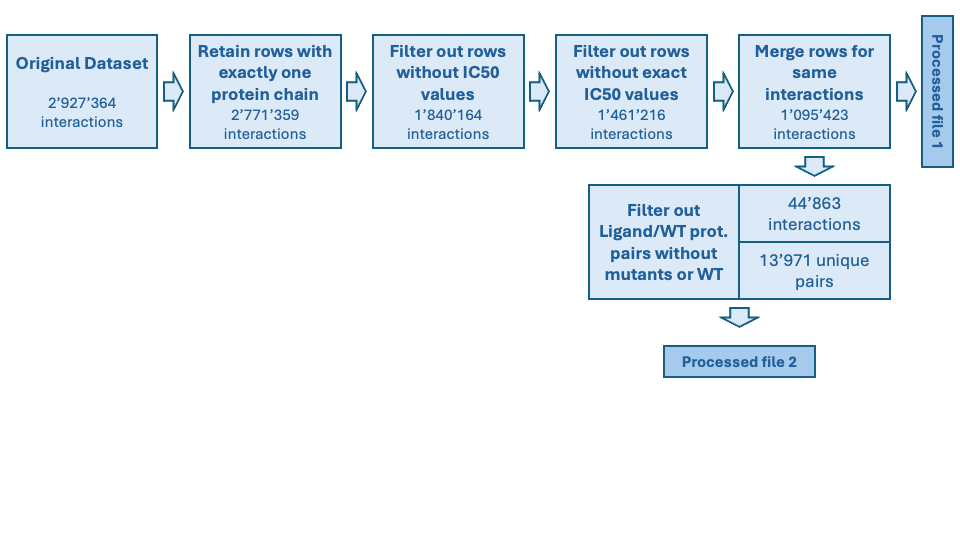

# Mutation-driven insights into protein structure and ligand group prediction through protein and ligand embeddings

## Abstract:
This project investigates how mutations in protein sequences affect ligand binding affinities, focusing on reference-mutant groups with a shared ligand. To identify mutation positions and types, we will use an alignment method that compares each mutated sequence to a reference. Potential key domains within the reference protein can be highlighted by plotting IC50 values against mutation positions and incorporating additional data on mutation characteristics, such as occurrence probability and chemical properties.
Additionally, we aim to develop a tool that assists researchers in fastening their ligand search when working with a new protein, replacing the usual resource-intensive, blind search with a protein-specific approach. To simplify the computation of protein similarity, we will embed proteins into a Euclidean space using a language model. Using their best-binding ligands as a label and after clustering ligands into coarse groups, we will train a classifier to output a potential ligand group given a protein sequence.

### Research Questions:

1) How do mutations in reference-mutant protein groups affect binding affinities with specific ligands?  
2) Can we identify key mutation sites that alter binding affinity?  
3) Can we predict the coarse pattern of interaction of an unseen protein using its learned sequence embedding and ligand clustering?  
4) Can a low-dimensional space capture meaningful protein-ligand behaviors? E.g. protein embeddings cluster according to their similarity and clusters can be labeled according to their binding affinity with ligand groups.  

### Proposed Additional Datasets:
No additional datasets are currently proposed. However, pre-trained models for sequence and ligand embedding are used. In particular, for sequence embedding and ligand embeddings we use ESM2 and ChemBERTA respectively.

### Methods:
1) **Preprocessing:** the following image shows the preprocessing steps done to perform analysis on mutant sequences. To focus on mutants, we created a new dataframe by grouping entries by ‘Ligand SMILES’ and ‘UniProt (SwissProt) Entry Name of Target Chain’. We retained only groups with multiple entries (to include mutants) and saved lists of mutant names and sequences for each unique ‘Ligand SMILES’/‘UniProt Entry Name’ pair. [Already done]


2) **Mutation Standardization and Analysis:** since the dataset does not provide a standard mutation format, we use the Needleman-Wunsch algorithm to automatically identify the differences between the reference sequence and the mutant ones. [Already done]  
3) **IC50 Graphing and Visualization:** for each reference-mutant group and ligand, report the IC50 variation between the reference protein and the mutants, taking into account both the mutation type and changes in amino acid properties. To characterize the nature of the mutations, we propose using an ESM2 masking model, where output probabilities are analyzed at the masked positions. We will need to account also the fact that most mutants have multiple mutations occurring at different positions. 
4) **Protein and ligand embedding, followed by dimensionality reduction:** We first intended to use protein and ligand encoders trained on drug-target interaction, like DeepDTA. This option was not successful (availability of model weights, costly training), so we decided to use single deep-learning encoders to generate embeddings for sequences and ligands, respectively ESM2 and ChemBERTa. For the sake of visualization on one hand, and for clustering on another hand, we embedded the protein and ligand real-valued representations onto a lower-dimensional space using UMAP. Since applying ESM2 to all the proteins would be computationally expensive, we need to preprocess the input to the model (e.g. truncate the protein sequences).
5) **Clustering and classification:** We want to use the clusters found in the low-dimensional ligand space through k-means as labels for the protein representations. We will use those labels to train a k-NN classifier and identify binding neighborhoods in the low-dimensional protein space, and infer potential ligands for new proteins.

### Proposed Timeline:
**Week 9:** Standardize mutation representation in dataset and conduct initial IC50 analysis. Test embedding models, apply dimensionality reduction, and visualize clusters. [Already done]   
**Week 10:** Homework 2  
**Week 11:** Generate IC50 graphs for selected reference-mutant groups. Train and validate k-NN classifier on clustered embeddings.  
**Week 12:** Explore amino acid properties for IC50 graphs part 1.   
**Week 13:** Explore amino acid properties for IC50 graphs part 2. Train and validate k-NN classifier on clustered embeddings. Start preparing project report. 
**Week 14:** Finalize analysis, visualize findings, and prepare project report.  

### Organization within the Team:
- **Team A:** (Viola, Tancredi & Alexis)  
   - W11: Generate IC50 graphs for selected reference-mutant groups.  
   - W12: Explore amino acid properties for IC50 graphs using hydrophobic values.  
   - W13: Explore amino acid properties for IC50 graphs using ESM2 and start preparing project report.  
   - W14: Finalize analysis, visualize findings, and prepare project report.  
- **Team B:** (Riccardo & Abigaïl)  
   - W11: Train and validate k-NN classifier on clustered embeddings.  
   - W12:   
   - W13:  
   - W14: Finalize analysis, visualize findings, and prepare project report.  


## Usage
```bash
# clone project
git clone git@github.com:epfl-ada/ada-2024-homework-1-abrac-adabra.git
cd ada-2024-homework-1-abrac-adabra.git

# install requirements
pip install -r pip_requirements.txt
```

